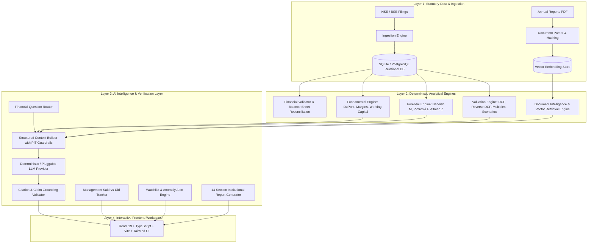

# Final System Architecture: AI-Powered Financial Intelligence Platform

## 1. Architectural Overview

The **Financial Decision Intelligence Platform for Indian Equities (NSE/BSE)** is a multi-tier, verifiable, and deterministic financial analysis and AI reasoning engine. Designed from the ground up for strict mathematical correctness, regulatory compliance (SEBI Research Analyst Regulations), and zero-hallucination guarantees, the system couples deterministic accounting engines with a verifiable retrieval-augmented AI analyst pipeline.

---

## 2. Core Architectural Principles

1. **Deterministic Foundations**:
   - Zero LLM math: All ROCE, DuPont 5-step, Beneish M-Score, Piotroski F-Score, Altman Z-Score, WACC, DCF enterprise values, and CAGRs are calculated via deterministic Python algorithms with 100% test coverage.
2. **Point-in-Time (PIT) Temporal Guardrails**:
   - Historical backtesting and simulation tools rigorously filter out any financial disclosure or annual report filing published after the chosen historical cut-off date (`as_of_year`), preventing lookahead bias.
3. **Mandatory Citation Grounding & Accusation Interception**:
   - The AI reasoning layer extracts granular analytical claims and validates them against retrieved source passages.
   - Defamatory or unsupported assertions (e.g., claiming a company "committed fraud" based solely on a statistical screening flag) are sanitized into objective analytical language ("statistical screening flag warrants investigation").
4. **Institutional Reporting & Watchlists**:
   - End-to-end 14-section equity research report synthesis.
   - Low-noise alert triggers for operating margin shifts, working capital spikes, and credit health transitions.
