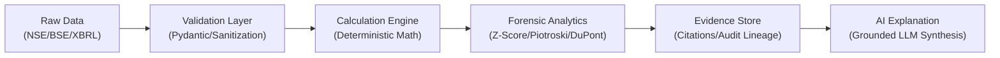

# System Architecture Overview

## Computational Pipeline

The platform operates on a strict multi-tiered computational pipeline:

## System Layers

### 1. Ingestion & Ingestion Staging
- Structured ingest from stock exchange filings, MCA XBRL submissions, and official disclosures.
- Raw payloads are stored immutably with SHA-256 hash checksums to guarantee audit reproducibility.

### 2. Validation & Reconciliation Layer
- Enforces fundamental accounting invariants before any calculations execute:
  - `Assets == Liabilities + Total Equity`
  - `Operating Cash Flow + Investing Cash Flow + Financing Cash Flow == Net Change in Cash`
  - Prior-period restatement reconciliation and adjustments.

### 3. Deterministic Computation Engine
- Pure Python calculation modules with zero LLM dependence.
- Ratios, multi-period CAGR, operating margins, return metrics (ROCE, ROE, ROIC), Altman Z-score, Piotroski F-score, Beneish M-Score, and working capital cycles.

### 4. Forensic & Decision Analytics
- Anomaly detection, quality of earnings screening, red-flag promoter share pledge alerts, and corporate governance indicator assessments.

### 5. Grounded AI Explanation Layer
- The LLM acts solely as a natural language communicator and synthesizer.
- Prompts are fed deterministic calculation results and explicit citations from filings. The LLM is strictly prohibited from inventing numbers or doing arithmetic.
